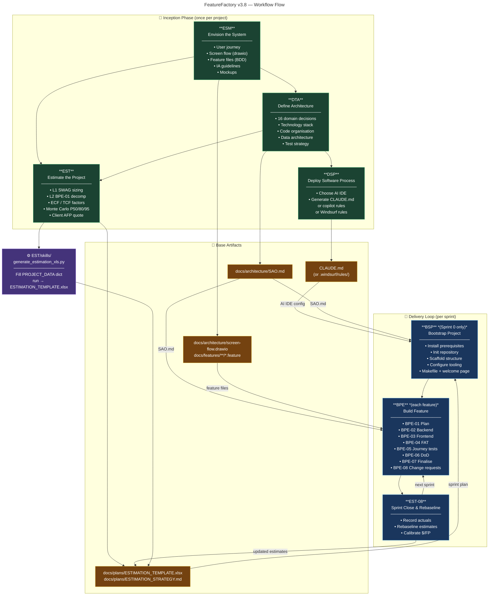

# FeatureFactory Playbook v3.8

**Playbook**: FeatureFactory
**Version**: 3.8 (Draft)
**Purpose**: End-to-end workflow for AI-assisted software product development — from idea to shipped feature, with estimation, architecture, and repeatable delivery.

---

## What This Playbook Does

FeatureFactory turns a product idea into running, tested, estimated software through a sequence of six workflows. The first four run once during **Inception** and produce the base artifacts every subsequent sprint depends on. The last two form the **Delivery Loop** that repeats every sprint.

---

## Workflow Map

### Inception Phase (runs once per project)

| # | Workflow | What It Produces | Key Output Artifact |
|---|----------|-----------------|---------------------|
| 1 | **ESM** — Envision the System | User journey, screen flow, feature files, IA, mockups | `docs/features/**`, `docs/architecture/screen-flow.drawio` |
| 2 | **DTA** — Define Architecture | Technical decisions across 16 domains → SAO | `docs/architecture/SAO.md` |
| 3 | **DSP** — Deploy Software Process | AI IDE configuration (CLAUDE.md / copilot rules / Windsurf rules) | `CLAUDE.md` or `.windsurf/rules/` |
| 4 | **EST** — Estimate the Project | Two-level estimates, Monte Carlo forecast, client quote | `docs/plans/ESTIMATION_TEMPLATE.xlsx`, `docs/plans/ESTIMATION_STRATEGY.md` |

**Gate condition**: All four Inception workflows must complete before Sprint 0 begins. BSP requires SAO.md (from DTA). EST Level 2 requires SAO.md + feature files (from ESM).

### Delivery Loop (repeats every sprint)

| # | Workflow | When It Runs | Key Output |
|---|----------|-------------|------------|
| 5 | **BSP** — Bootstrap Project | Sprint 0 only | Runnable project, Makefile, dependencies |
| 6 | **BPE** — Build Feature | Every sprint, once per feature | Implemented + tested feature, DoD signed off |
| — | **EST-08** — Sprint Close & Rebaseline | End of every sprint | Updated estimates, calibrated $/FP |

---

## Base Artifacts

These four artifacts are the foundation. Every workflow in the Delivery Loop reads them. Keep them current.

```
CLAUDE.md                              ← AI IDE process config (DSP output)
docs/architecture/SAO.md               ← Technology stack, code organization, patterns (DTA output)
docs/architecture/screen-flow.drawio   ← Screen map, navigation flows (ESM output)
docs/features/**/*.feature             ← BDD scenarios, one file per feature (ESM output)
docs/plans/ESTIMATION_TEMPLATE.xlsx   ← Live estimates, Monte Carlo, client quote (EST output)
docs/plans/ESTIMATION_STRATEGY.md     ← Estimation level, risk profile, sprint cadence (EST output)
```

---

## Visual Workflow Diagram



---

## Workflow Dependencies

```
ESM ──────────────────────────────────────────────────┐
     └─ screen-flow.drawio + docs/features/**          │
                                                       ▼
DTA ──► SAO.md ──────────────────────────────────────► DSP ──► CLAUDE.md
             └──────────────────────────────────────► EST ──► ESTIMATION_TEMPLATE.xlsx
                                                              └──► BSP ──► runnable project
                                                                        └──► BPE (loop)
```

---

## Estimation Integration

EST is a two-level workflow embedded in Inception:

- **Level 1 (SWAG)** — T-shirt sizing from feature files. Runs as soon as ESM completes. Produces rough token budget and client quote range.
- **Level 2 (Detailed)** — BPE-01 dry-run per work package. Runs after SAO.md exists. Produces PERT triplets per artifact, WBS, bottom-up total.
- **Monte Carlo** — 10,000 iterations over PERT triplets. Produces P50/P80/P95 for token budget, duration, and AFP.
- **Sprint Close** — EST-08 rebaselines after each BPE cycle. Converges estimates toward actuals.

The `generate_estimation_xls.py` skill (in `EST/skills/`) automates the full XLS build from a project data dict. Windsurf calls it; it outputs `docs/plans/ESTIMATION_TEMPLATE.xlsx` ready to open.

---

## Rules That Cross All Workflows

1. **SAO.md is the single source of architectural truth.** Every workflow that touches code reads SAO.md first. If SAO.md is stale, update DTA before proceeding.
2. **Feature files are the scope contract.** EST sizes from them; BPE implements them; tests verify them. Do not implement work that has no `.feature` file.
3. **Estimates are living documents.** Level 1 → Level 2 → Sprint Close is a convergence loop. Never treat an estimate as final.
4. **Sprint 0 overhead is always quoted separately.** BSP + DSP FP must appear as a line item on the client quote, never blended into feature FPs.
5. **DoD is non-negotiable.** BPE-06 applies to every feature regardless of size. No feature ships without DoD sign-off.

---

## Workflow Files

Each workflow lives in its own subdirectory:

```
FeatureFactory/
├── playbook.md          ← this file (includes Mermaid diagram)
├── ESM/                 ← Envision the System (7 activities)
├── DTA/                 ← Define Architecture (18 activities)
├── DSP/                 ← Deploy Software Process (6 activities)
├── EST/                 ← Estimate the Project (8 activities)
│   ├── skills/
│   │   └── generate_estimation_xls.py   ← XLS skill (call from Windsurf)
│   └── artifacts/
├── BSP/                 ← Bootstrap Project (8 activities)
└── BPE/                 ← Build Feature (8 activities)
```

---

## Editing This Playbook

- To add a new workflow: create a new subdirectory with `_workflow.md` and activity files.
- To reorder workflows within a phase: update the Workflow Map table and the Visual Workflow Diagram (Mermaid) in this file.
- After editing any workflow: run `import_workflow_from_local` MCP tool to sync with Taciturn.
- Version bumps: increment minor version for new activities, major for phase restructuring.
