# FeatureFactory Playbook v11.8

**Playbook**: FeatureFactory
**Version**: 11.8 (Draft)
**Purpose**: End-to-end workflow for AI-assisted software product development — from idea to shipped feature, with estimation, architecture, and repeatable delivery.

---

## What This Playbook Does

FeatureFactory turns a product idea into running, tested, estimated software through a sequence of ten workflows. The first six run once during **Inception** and produce the base artifacts every subsequent sprint depends on. The last four form the **Delivery Loop** that repeats every iteration.

---

## Workflow Map

### Inception Phase (runs once per project)

| # | Workflow | What It Produces | Key Output Artifact |
|---|----------|-----------------|---------------------|
| 1 | **ESM** — Envision the System | User journey, screen flow, feature files, IA, mockups | `docs/features/**`, `docs/architecture/screen-flow.drawio` |
| 2 | **DTA** — Define Architecture | Technical decisions across 16 domains → SAO | `docs/architecture/SAO.md` |
| 3 | **DSP** — Deploy Software Process | AI IDE configuration (CLAUDE.md / copilot rules / Windsurf rules) | `CLAUDE.md` or `.windsurf/rules/` |
| 4 | **EST** — Estimate the Project | Two-level estimates, Monte Carlo forecast, client quote | `docs/plans/ESTIMATION_TEMPLATE.xlsx`, `docs/plans/ESTIMATION_STRATEGY.md` |
| 5 | **DCI** — Design & Deploy Cloud Infra | Infra repo with CDK stacks (VPC, EKS, ECR, Route53), Makefile targets, GH Actions | `{project}-infra/` repo, `docs/architecture/INFRA_REQUIREMENTS.md` |
| 6 | **DCD** — Design & Deploy CICD | Helm chart, CI/CD pipelines (GH Actions), deployment Make targets | `deploy/helm/`, `.github/workflows/ci.yml`, `.github/workflows/cd.yml` |

**Gate condition**: All six Inception workflows must complete before Sprint 0 begins. BSP requires SAO.md (from DTA). EST Level 2 requires SAO.md + feature files (from ESM). DCI requires SAO.md + estimation. DCD requires DCI (infra must exist before CICD can deploy to it).

### Delivery Loop (repeats every iteration)

| # | Workflow | When It Runs | Key Output |
|---|----------|-------------|------------|
| 7 | **BSP** — Bootstrap Project | Sprint 0 only | Runnable project, Makefile, dependencies |
| 8 | **BPE** — Build Feature | Used inside PIT-04 per scenario | BPE-01 plan + skeletons per scenario |
| 9 | **PIT** — Plan Iteration | Before every iteration | Execution manifest, GitHub Milestone + Issues, code skeletons |
| 10 | **MIT** — Manage Iteration | After PIT, per iteration | Implemented scenarios, GitHub Release, Lessons Learned, EST-08 rebaseline |
| — | **EST-08** — Sprint Close & Rebaseline | Embedded in MIT-06 | Updated estimates, calibrated $/FP |

---

## Base Artifacts

These artifacts are the foundation. Every workflow in the Delivery Loop reads them. Keep them current.

```
CLAUDE.md                              ← AI IDE process config (DSP output); includes Iteration Protocol for Jedao
docs/architecture/SAO.md               ← Technology stack, code organization, patterns (DTA output)
docs/architecture/screen-flow.drawio   ← Screen map, navigation flows (ESM output)
docs/features/**/*.feature             ← BDD scenarios, one file per feature (ESM output)
docs/plans/ESTIMATION_TEMPLATE.xlsx   ← Live estimates, Monte Carlo, client quote (EST output)
docs/plans/ESTIMATION_STRATEGY.md     ← Estimation level, risk profile, sprint cadence (EST output)
docs/architecture/INFRA_REQUIREMENTS.md ← AWS services, blue/green strategy, cost (DCI output)
docs/architecture/CICD_REQUIREMENTS.md  ← Pipeline stages, make targets, environments (DCD output)
{project}-infra/                        ← Separate infra repo with CDK stacks (DCI output)
deploy/helm/{project}/                  ← Helm chart + per-env values (DCD output)
.github/workflows/ci.yml               ← CI pipeline (DCD output)
.github/workflows/cd.yml               ← CD pipeline (DCD output)
Makefile                                ← Single orchestration layer (BSP + DCI + DCD)
docs/plans/iterations/ITER-*.yaml      ← Execution manifests (PIT output, consumed by MIT)
docs/lessons_learned/ITER-*.md         ← Iteration retrospectives (MIT output, consumed by PIT)
```

## Artifact Templates

Reusable templates that live in each workflow's `artifacts/` directory. **DSP-05** inventories all of these when generating the AI IDE configuration — the "Artifact Templates" section of CLAUDE.md / copilot-instructions / Windsurf rules is built from this list.

| Template | Workflow | Output Path | Used By |
|----------|----------|-------------|---------|
| User Journey Template | ESM | `ESM/artifacts/user_journey_template.md` | ESM-02, DSP-05 |
| IA Guidelines Template | ESM | `ESM/artifacts/ia_guidelines_template.md` | ESM-03, DSP-05 |
| Feature File Template (Gherkin) | ESM | `ESM/artifacts/feature_file_template.feature` | ESM-05, DSP-05 |
| System Architecture Overview Template | DTA | `DTA/artifacts/sao_document_template.md` | DTA-18, DSP-02, DSP-03, DSP-05, BPE-01 |
| CLAUDE.md Template | DSP | `DSP/artifacts/claude_md_template.md` | DSP-05 → DSP-06 |
| Copilot Instructions Template | DSP | `DSP/artifacts/copilot_instructions_template.md` | DSP-05 → DSP-06 |
| Windsurf/Cursor Rules Template | DSP | `DSP/artifacts/windsurf_cursor_rules_template.md` | DSP-05 → DSP-06 |
| Makefile Template | BSP | `BSP/artifacts/makefile_template.mk` | BSP-06, DSP-05 |
| Helm Chart Template | DCD | `DCD/artifacts/` (reference structure) | DCD-04, DSP-05 |
| Infra Repo Scaffold | DCI | `DCI/artifacts/` (reference structure) | DCI-02–04, DSP-05 |
| Implementation Plan Template | BPE | `BPE/artifacts/implementation_plan_template.md` | BPE-01 → BPE-04, DSP-05 |
| Definition of Done Checklist Template | BPE | `BPE/artifacts/definition_of_done_checklist_template.md` | BPE-06, DSP-05 |

---

## Workflow Dependencies

```mermaid
flowchart LR
    ESM["ESM<br/>Envision the System"]
    DTA["DTA<br/>Define Architecture"]
    DSP["DSP<br/>Deploy Software Process"]
    EST["EST<br/>Estimate the Project"]
    DCI["DCI<br/>Design &amp; Deploy<br/>Cloud Infra"]
    DCD["DCD<br/>Design &amp; Deploy<br/>CICD"]
    BSP["BSP<br/>Bootstrap Project"]
    BPE["BPE<br/>Build Feature<br/>used inside PIT"]
    PIT["PIT<br/>Plan Iteration<br/>human+AI composite"]
    MIT["MIT<br/>Manage Iteration<br/>Jedao autonomous"]

    SCREEN["screen-flow.drawio<br/>+ docs/features/**"]
    SAO["SAO.md"]
    CLAUDE["CLAUDE.md<br/>+ Iteration Protocol"]
    ESTIMATION["ESTIMATION_TEMPLATE.xlsx"]
    INFRA["infra repo<br/>+ INFRA_REQUIREMENTS.md"]
    CICD["Helm chart<br/>+ CI/CD workflows"]
    PROJECT["runnable project"]
    MANIFEST["Execution Manifest YAML<br/>+ GitHub Milestone/Issues"]
    LESSONS["docs/lessons_learned/<br/>ITER-*.md"]

    ESM --> SCREEN
    ESM --> DTA
    DTA --> SAO
    SAO --> DSP
    SAO --> EST
    SAO --> DCI
    DSP --> CLAUDE
    EST --> ESTIMATION
    DCI --> INFRA
    INFRA --> DCD
    DCD --> CICD
    ESTIMATION --> BSP
    CICD --> BSP
    BSP --> PROJECT
    PROJECT --> PIT
    CLAUDE --> PIT
    LESSONS -.->|"orient input"| PIT
    PIT --> MANIFEST
    MANIFEST --> MIT
    MIT --> LESSONS
    MIT -->|"EST-08 rebaseline"| ESTIMATION
    PIT -.->|"BPE-01 per scenario"| BPE

    SCREEN -.-> EST

    classDef workflow fill:#e3f2fd,stroke:#1976d2,stroke-width:2px
    classDef artifact fill:#fff3e0,stroke:#f57c00,stroke-width:2px
    classDef deliveryloop fill:#e8f5e9,stroke:#388e3c,stroke-width:2px

    class ESM,DTA,DSP,EST,DCI,DCD,BSP,BPE workflow
    class SCREEN,SAO,CLAUDE,ESTIMATION,INFRA,CICD,PROJECT,MANIFEST,LESSONS artifact
    class PIT,MIT deliveryloop
```



---

## Estimation Integration

EST is a two-level workflow embedded in Inception:

- **Level 1 (SWAG)** — T-shirt sizing from feature files. Runs as soon as ESM completes. Produces rough token budget and client quote range.
- **Level 2 (Detailed)** — BPE-01 dry-run per work package. Runs after SAO.md exists. Produces PERT triplets per artifact, WBS, bottom-up total.
- **Monte Carlo** — 10,000 iterations over PERT triplets. Produces P50/P80/P95 for token budget, duration, and AFP.
- **Sprint Close** — EST-08 rebaselines after each BPE cycle. Converges estimates toward actuals.

The `generate_estimation_xls.py` skill (in `EST/skills/`) automates the full XLS build from a project data dict. Windsurf calls it; it outputs `docs/plans/ESTIMATION_TEMPLATE.xlsx` ready to open.

---

## Rules That Cross All Workflows

1. **SAO.md is the single source of architectural truth.** Every workflow that touches code reads SAO.md first. If SAO.md is stale, update DTA before proceeding.
2. **Feature files are the scope contract.** EST sizes from them; BPE implements them; tests verify them. Do not implement work that has no `.feature` file.
3. **Estimates are living documents.** Level 1 → Level 2 → Sprint Close is a convergence loop. Never treat an estimate as final.
4. **Sprint 0 overhead is always quoted separately.** BSP + DSP + DCI + DCD FP must appear as a line item on the client quote, never blended into feature FPs.
5. **DoD is non-negotiable.** BPE-06 applies to every feature regardless of size. No feature ships without DoD sign-off.
6. **Makefile is the single orchestration layer.** Every operation (dev, infra, deploy, switch) is a `make` target. GH Actions workflows are thin wrappers calling `make` in sequence. Local and CI/CD use identical commands.

---

## Workflow Files

Each workflow lives in its own subdirectory:

```
FeatureFactory/
├── playbook.md          ← this file (includes Mermaid diagram)
├── ESM/                 ← Envision the System (7 activities)
├── DTA/                 ← Define Architecture (18 activities)
├── DSP/                 ← Deploy Software Process (6 activities)
├── EST/                 ← Estimate the Project (8 activities)
│   ├── skills/
│   │   └── generate_estimation_xls.py   ← XLS skill (call from Windsurf)
│   └── artifacts/
├── DCI/                 ← Design & Deploy Cloud Infra (7 activities)
│   ├── skills/
│   │   ├── aws_cdk_python.md            ← AWS CDK patterns
│   │   └── k8s_eks_deployment.md        ← K8s/EKS deployment patterns
│   └── artifacts/
│       ├── infra_repo_scaffold.md       ← Infra repo structure template
│       ├── cdk_stack_templates.py       ← CDK stack skeletons
│       └── infra_gh_workflow.yml        ← GH Actions for infra deploy
├── DCD/                 ← Design & Deploy CICD (7 activities)
│   ├── skills/
│   │   └── github_actions_patterns.md   ← GH Actions CI/CD patterns
│   └── artifacts/
│       ├── helmchart_template.md         ← Helm chart structure
│       ├── ci_workflow.yml              ← CI pipeline template
│       └── cd_workflow.yml              ← CD pipeline template
├── BSP/                 ← Bootstrap Project (8 activities)
│   └── artifacts/
│       └── makefile_template.mk         ← Makefile template (base + extension points)
├── BPE/                 ← Build Feature (8 activities; used inside PIT-04 per scenario)
├── PIT/                 ← Plan Iteration (9 activities; human+AI composite planning)
│   ├── _workflow.md
│   ├── PIT-01-Read_Lessons_Learned.md
│   ├── PIT-02-Select_Iteration_Goal.md
│   ├── PIT-03-Sequence_Scenarios.md
│   ├── PIT-04-Run_BPE-01_and_Create_Skeletons_per_Scenario.md
│   ├── PIT-05-Revise_Conflict_Map_and_Build_Manifest.md
│   ├── PIT-06-Define_Checkpoints_and_Hooks.md
│   ├── PIT-07-Publish_to_GitHub.md
│   ├── PIT-08-Human_Acceptance_Review.md
│   └── PIT-09-Prepare_Jedao_Brief.md
└── MIT/                 ← Manage Iteration (6 activities; Jedao autonomous execution)
    ├── _workflow.md
    ├── MIT-01-Activate_Iteration.md
    ├── MIT-02-Execute_Scenario.md
    ├── MIT-03-Handle_Drift.md
    ├── MIT-04-Human_Decision_Sync.md
    ├── MIT-05-Course_Correct_Manifest.md
    └── MIT-06-Close_Iteration.md
```

---

## Iteration Execution Model (PIT + MIT)

PIT and MIT implement a short, time-boxed execution cadence with a human-AI composite authority model.

### Doctrine (v1.0)
Two primary imperatives govern every iteration:
1. **Iterate in ~1 hour** — each scenario is sized to fit within one hour of execution. If it doesn't fit, decompose it.
2. **Hit the goal with minimum end-iteration rework** — conflict detection, skeleton-first design, and file-level footprint tracking prevent agents from colliding in the codebase.

### Key Concepts

| Term | Definition |
|---|---|
| Iteration | A time-boxed execution of 2–5 scenarios against a single goal (target: ~1h critical path) |
| Scenario | Smallest unit of work; one GitHub Issue; has a single checkpoint command that proves it done |
| Execution Manifest | YAML file + GitHub Milestone description defining the full iteration plan |
| Codebase Footprint | Exact list of files a scenario will touch, derived from skeleton `git diff` |
| Conflict Map | Files shared between scenarios → serialization required |
| Drift Signal | Detected deviation: `time_overrun`, `test_failure`, `scope_expansion`, `integration_conflict` |
| Jedao | Autonomous execution agent; authority-bounded; escalates when thresholds breach |

### GitHub as Operational Blackboard

| GitHub Object | Purpose |
|---|---|
| Milestone | Iteration record; description holds `<!-- MANIFEST -->` YAML |
| Issue | Scenario record; body holds `<!-- SCENARIO -->` YAML + BPE-01 plan |
| Issue Labels | State machine: `status-queued` → `status-in-progress` → `status-done` |
| Issue Comments | Checkpoint pass, drift signals, escalations, decisions |
| Release | Iteration closure record; created by MIT-06 |

### CLAUDE.md Iteration Protocol

CLAUDE.md must contain an `## Iteration Protocol` section for Jedao to function. PIT-09 verifies it is current before activating MIT. See `PIT/PIT-09-Prepare_Jedao_Brief.md` for the required template.

---

## Editing This Playbook

- To add a new workflow: create a new subdirectory with `_workflow.md` and activity files.
- To reorder workflows within a phase: update the Workflow Map table and the Visual Workflow Diagram (Mermaid) in this file.
- After editing any workflow: run `import_workflow_from_local` MCP tool to sync with Taciturn.
- Version bumps: increment minor version for new activities, major for phase restructuring.
